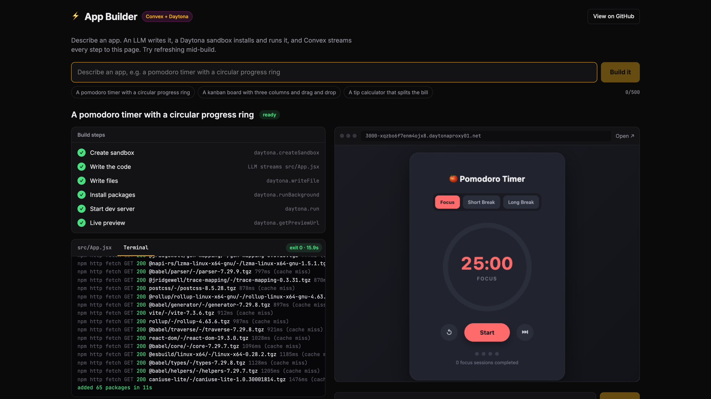

# App Builder: Convex + Daytona

A tiny "Lovable". Describe an app, an LLM writes it, and a [Daytona](https://www.daytona.io) sandbox installs and runs it. [Convex](https://www.convex.dev) streams every step to the page, ending with your app running live in an iframe. Then ask for changes ("make it dark mode") and watch it hot-reload.



Try the live demo: TODO: live demo link

## Why a sandbox?

Convex actions run JavaScript, but they can't run a shell, `npm install` or a Vite dev server. You also don't want LLM-written code running next to your database and API keys. A Daytona sandbox is a separate, throwaway computer for exactly that, and the [`@daytona/convex`](https://www.convex.dev/components/daytona/convex) component wires it into Convex with reactive tables.

What you can see on screen:

- **Live code**: the LLM's output streams into the database every 300ms, so `src/App.jsx` writes itself in the UI.
- **Live install logs**: `npm install` runs with `daytona.runBackground`, and its logs scroll in a terminal panel straight from the component's execution row. No polling code in the frontend.
- **Durable builds**: the build is a chain of scheduled functions, so you can refresh (or close the tab) mid-build and it carries on.
- **Hot reload**: follow-up prompts rewrite `App.jsx` in the sandbox and Vite updates the iframe.

## Run your own

You need Node 20+, a Convex account and a [Daytona API key](https://app.daytona.io/dashboard/keys).

```bash
git clone https://github.com/get-convex/convex-daytona-app-builder
cd convex-daytona-app-builder
npm install
npx convex dev --once          # creates your deployment (the first push asks for the key below)
npx convex env set DAYTONA_API_KEY dtn_...
npm run dev
```

Open http://localhost:5173 and describe an app.

On Daytona tiers below 3, each new preview link shows a warning page inside the iframe first. Click "I Understand, Continue" to get to your app. Tier 3 removes the warning page, see [Daytona's preview docs](https://www.daytona.io/docs/en/preview/#warning-page).

### The LLM: Convex AI Gateway

The code is generated through the [Convex AI Gateway](https://docs.convex.dev/ai-gateway/setup), so there's no LLM API key to manage. It works on cloud deployments in a **paid** Convex team. The model is the `MODEL` constant at the top of `convex/builder.ts` (`anthropic/claude-sonnet-5`; swap in `anthropic/claude-haiku-4.5` for faster, cheaper builds).

On a free team, use OpenAI (or any AI SDK provider) instead. `npm install @ai-sdk/openai`, set `npx convex env set OPENAI_API_KEY sk-...`, then change two lines in `convex/builder.ts`:

```ts
import { openai } from '@ai-sdk/openai' // was: import { convexGateway } from '@convex-dev/ai-sdk-provider'

model: openai('gpt-5.4'), // was: model: convexGateway(MODEL),
```

### Host the frontend on Convex

The frontend is served from your deployment with [`@convex-dev/static-hosting`](https://github.com/get-convex/static-hosting):

```bash
npm run upload:dev   # build + upload to your dev deployment: https://<deployment>.convex.site
npm run deploy       # production: deploy the backend and upload the frontend
```

## How it works

```
Browser (useQuery: live)
  │  apps.build({ sessionId, prompt })   rate limits, sandbox cap, insert row
  ▼
builder.createApp        daytona.createSandbox  ║  LLM streams App.jsx into the row
                         daytona.writeFile      (Vite scaffold + App.jsx)
                         daytona.runBackground  ("npm install", returns straight away)
  ▼
builder.waitForInstall   reads the install's execution row once a second
  ▼
builder.startDevServer   daytona.run (start Vite)  →  daytona.getPreviewUrl  →  iframe
```

| File | What's in it |
| --- | --- |
| `convex/apps.ts` | Public API: `build`, `edit`, `list`, `installLogs`, plus the abuse checks |
| `convex/builder.ts` | The build pipeline: sandbox, LLM, files, install, dev server |
| `convex/scaffold.ts` | The fixed Vite + React scaffold and the system prompt |
| `convex/limits.ts` | Every limit in one place |
| `convex/reset.ts`, `convex/crons.ts` | The 12 hour reset |
| `src/AppWorkspace.tsx` | Build steps, code and terminal panels, preview, edit box |

The interesting bit is starting `npm install` in the background and reading its logs reactively:

```ts
// convex/builder.ts: start the install and return immediately
const { executionId } = await daytona.runBackground(ctx, {
  sandboxId,
  command: 'npm install --no-audit --no-fund --no-update-notifier --loglevel=http',
  cwd: APP_DIR,
})

// convex/apps.ts: the component's poller keeps this execution row up to date
export const installLogs = query({
  args: { sessionId: v.string(), appId: v.id('apps') },
  handler: async (ctx, args) => {
    const app = await ctx.db.get('apps', args.appId)
    if (!app || app.sessionId !== args.sessionId || !app.installExecutionId) return null
    const execution = await daytona.getExecution(ctx, { executionId: app.installExecutionId })
    // ...status, output, exit code
  },
})
```

`runBackground` doesn't have an "on finished" callback, so `builder.waitForInstall` is a small mutation that checks the execution row every second and schedules the dev server step once npm is done. Nothing sits waiting in an action.

## Abuse protection and the 12 hour reset

The hosted demo is public and every build costs real Daytona and LLM money, so these are always on. Tweak them in `convex/limits.ts`.

- **Anonymous session id**: a UUID kept in localStorage, used for per-session limits and as the sandbox `userKey`. It's easy to fake, so the global limits are the real backstop.
- **Rate limits** with [`@convex-dev/rate-limiter`](https://www.convex.dev/components/rate-limiter): 5 new apps per session per hour and 60 across everyone. Edits are cheaper (no new sandbox): 15 per session and 150 overall per hour.
- **Sandbox cap**: no new builds while 8 sandboxes are live, or 2 for one session.
- **Input caps**: prompts up to 500 characters and LLM output capped at 8,000 tokens.
- **Short-lived sandboxes**: labelled `app: convex-daytona-app-builder`, paused after 10 idle minutes and deleted after 60.
- **12 hour reset**: `crons.ts` runs `reset.resetDemo`, which deletes every sandbox the component knows about that isn't already gone and wipes the `apps` table. It's safe to run any time: `npx convex run reset:resetDemo`.

## Links

- [`@daytona/convex` component](https://www.convex.dev/components/daytona/convex)
- [Daytona docs](https://www.daytona.io/docs)
- [Convex docs](https://docs.convex.dev)

## License

Apache-2.0. Based on Daytona's [AI App Builder guide](https://github.com/daytona/guides/tree/main/typescript/convex/ai-app-builder) (Apache-2.0), with the build reworked into scheduled steps, `runBackground` with live install logs, the Convex AI Gateway, abuse protection and static hosting.
